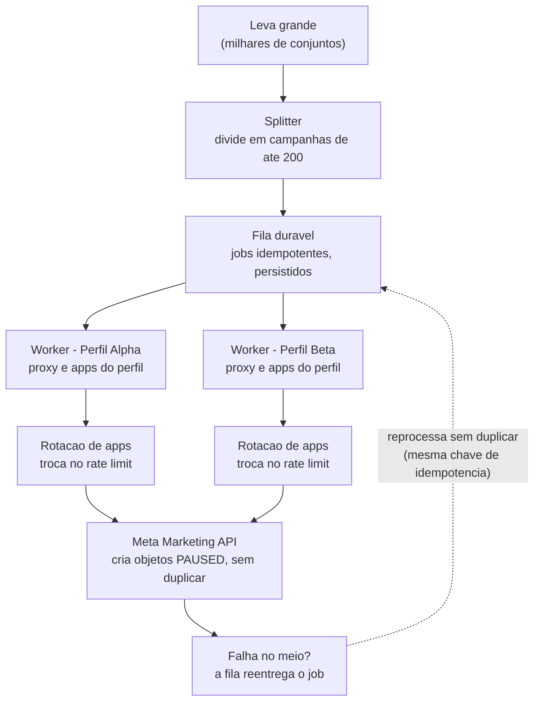

# Mini Central de Upload de Anúncios

Aplicação que simula o fluxo operacional de subida de anúncios na Meta: o gestor
escolhe uma conexão, envia um vídeo, configura uma leva, pode sair e voltar sem
perder o rascunho, executa um pré-voo visual e só consegue simular o envio quando
todos os checks obrigatórios estão aprovados.

---

## Stack

- **Backend:** Node.js + Express (TypeScript, ESM), Prisma + PostgreSQL, Vitest.
- **Frontend:** React + Vite (TypeScript), Tailwind CSS.
- **Banco:** PostgreSQL via Docker.

---

## Arquitetura

### Backend — camadas no estilo Clean Architecture / Ports & Adapters

- **Controllers** — camada HTTP fina: recebem a requisição, chamam o use case,
  tratam erros e formatam a resposta. Não contêm regra de negócio.
- **Use Cases** — cada operação de negócio isolada (executar pré-voo, simular envio,
  criar perfil, listar perfis, upload de vídeo). Não conhecem HTTP nem o banco.
- **Repositories** — definidos por **interface** (a "porta"); as implementações
  (Prisma e in-memory) são adaptadores intercambiáveis. Os use cases dependem da
  interface, nunca da implementação concreta — inversão de dependência. É o que
  permite rodar e testar o núcleo sem subir o banco.
- **Injeção de dependência manual** na composição das rotas — sem container,
  adequado à escala do projeto.

### Frontend — organização por responsabilidade

- **`api/`** — acesso ao backend.
- **`context/`** — estado global do rascunho (React Context) com persistência
  automática em localStorage. É o que sobrevive ao F5.
- **`steps/`** — cada etapa do wizard como componente independente que lê e escreve
  no rascunho compartilhado.
- **`components/`** — componentes reutilizáveis (ex.: modal de cadastro de perfil).
- **`types/`** — contratos TypeScript espelhando as respostas da API.

O front consome os endpoints como contratos, da mesma forma que os use cases
consomem os repositórios: a implementação por trás pode mudar sem afetar quem consome.

---

## Como rodar

### Pré-requisitos
- Node.js 20+
- Docker (para o PostgreSQL)

### 1. Banco de dados (Docker)

Na raiz do projeto:

```bash
docker compose up -d
```

Sobe um Postgres em `localhost:5432` (usuário `admin`, senha `adminpassword`, banco
`minicentral`). Aguarde o container subir antes do próximo passo.

### 2. Backend

```bash
cd backend
npm install
cp .env.example .env          # a DATABASE_URL já aponta para o Postgres do Docker
npx prisma migrate dev        # cria as tabelas
npx prisma db seed            # popula Perfil Alpha (2 contas) e Beta
npm run dev                   # http://localhost:3000
```

Testes automatizados:
```bash
npm test
```

### 3. Frontend

Em outro terminal:
```bash
cd frontend
npm install
npm run dev                   # http://localhost:5173
```

O Vite faz proxy de `/api` para `localhost:3000` — sem configuração de CORS em
desenvolvimento.

---

## Endpoints

| Método | Rota             | Descrição                                                              |
|--------|------------------|------------------------------------------------------------------------|
| GET    | `/api/profiles`  | Lista perfis com apps/contas/páginas/pixels (token e proxy mascarados) |
| POST   | `/api/profiles`  | Cadastra um perfil novo com a hierarquia validada                      |
| POST   | `/api/upload`    | Recebe um `.mp4` e devolve `mediaId` (não processa o vídeo)            |
| POST   | `/api/preflight` | Executa o pré-voo; reutiliza checks não afetados via `sessionId`       |
| POST   | `/api/submit`    | Simula o envio; gate + idempotência via header `Idempotency-Key`       |

---

## Decisões e premissas

### Modelagem
Página e pixel pertencem à **conta**, não ao perfil. Isso é o que dá sentido à
invalidação por escopo: trocar a conta invalida conta/página/pixel, mas mantém
proxy e credencial (que pertencem ao perfil). O schema Prisma reflete a hierarquia
com chaves estrangeiras.

### Pré-voo e reteste por escopo
Cada check retorna seu estado (`EXECUTED` / `REUSED`) além de aprovado/reprovado com
a mensagem da pendência. O front reenvia um `sessionId` devolvido pelo pré-voo; o
back-end guarda o payload e os resultados dessa sessão (em memória) e, na rodada
seguinte, reexecuta apenas o que mudou e o que depende do que mudou — o restante
volta como `REUSED`.

**A verdade sobre o que mudou é do servidor.** O cliente só reenvia o `sessionId`,
nunca o payload anterior cru — assim o front não consegue forjar um `REUSED`.

A validação de pertencimento é feita no banco: cada check confere não só que o
ativo existe, mas que ele pertence à conta/perfil correto (ex.: um pixel de outra
conta reprova o check, mesmo existindo). É isso que sustenta a invalidação por
troca de conta.

### Gate no back-end
O `/submit` executa um pré-voo **limpo** (sem reutilizar a sessão) e só cria o job se
todos os checks obrigatórios passarem. O cache do pré-voo é otimização, nunca
autorização: mesmo que o front libere o botão, o back-end confere o gate por conta
própria e devolve 409 com os checks que falharam se algo estiver pendente.

### Idempotência
Escolhi **`Idempotency-Key` gerada pelo cliente** (header). O front gera a chave uma
única vez, no momento em que o gate aprova o envio, e a persiste no rascunho. Retry
de rede, clique duplo ou F5 no meio do envio reusam a mesma chave e recebem o mesmo
`job_id` — nenhum job duplicado.

Comparado às alternativas: hash do payload trataria dois envios legítimos idênticos
como o mesmo (mesma intenção ≠ mesma requisição); id do rascunho amarraria "um
rascunho = um job para sempre". A chave do cliente separa "a mesma tentativa" de
"uma nova tentativa", que é o comportamento correto.

### Fallback sem banco
A validação do pré-voo é abstraída por interface (`PreFlightValidationRepository`),
com duas implementações: `PrismaValidationRepository` (usa o Postgres) e
`InMemoryValidationRepository` (mesmos dados de Alpha/Beta em memória). A fiação das
rotas escolhe por `DATABASE_URL` — sem banco, o núcleo do pré-voo roda e é testado
em memória. É a mesma abstração que os testes automatizados usam, o que os torna
rápidos e independentes de infraestrutura.

### Rascunho
Persistido automaticamente no localStorage a cada mudança, sem botão de salvar.
Sobrevive ao F5, à troca de passos do wizard e ao fechar/abrir a página. Guarda o
`mediaId` do vídeo (devolvido pelo upload), **nunca o arquivo** — por isso o upload
vai ao servidor: um arquivo do seletor do navegador não sobrevive ao F5, mas o
identificador sim. O `sessionId` do pré-voo e a `Idempotency-Key` também vivem no
rascunho, para sobreviverem à navegação entre passos.

### Segredos
Token e proxy nunca são retornados por inteiro pela API. O utilitário `maskSecret`
mostra apenas os últimos caracteres. O valor real fica no banco; o mascaramento é
responsabilidade da camada de resposta.

### Upload de vídeo
"Recebido" significa que o arquivo chegou ao back-end e o rascunho tem o
identificador. Não há processamento de codec nem thumbnail (conforme a FAQ). O
arquivo é salvo em disco temporário via multer; guarda-se apenas o `mediaId`.

---

## Testes automatizados

Cobrem as regras mais críticas:
- **Reteste por escopo:** trocar a conta invalida conta/página/pixel e mantém o
  perfil como `REUSED`; corrigir só o pixel reexecuta apenas ele.
- **Gate + idempotência:** o gate bloqueia payload inválido independente do front;
  a mesma `Idempotency-Key` devolve o mesmo `job_id`.
- **Segredos:** `maskSecret` nunca expõe o valor completo; a listagem de perfis não
  retorna token/proxy crus.

Os testes usam as implementações in-memory dos repositórios, então rodam rápido e
sem depender do Postgres.

---

## O que foi implementado, simulado e deixado de fora

**Implementado:** as 4 etapas do fluxo, cadastro de perfil pela interface, upload
real com identificador, rascunho com recuperação após F5, pré-voo no back-end com
reteste por escopo, gate no envio, envio idempotente, persistência em Postgres via
Prisma (com fallback em memória), e testes automatizados.

**Simulado:** o envio não chama a Meta — devolve um job fictício com status `PAUSED`.
Tokens, proxies e IDs são fictícios; o mascaramento é de interface, sem criptografia
real (conforme a FAQ).

**Deixado no desenho (explicado no vídeo):** validação real de token e descoberta de
contas/páginas/pixels; teste real de proxy; envio à Meta; rotação entre aplicativos
sob rate limit; upload em várias contas/perfis; split em campanhas de até 200
conjuntos; fila durável e retomada de falha parcial; criptografia de segredos;
limpeza dos arquivos temporários de upload.

---

## Uso de IA

Usei **Claude Code** como par de programação ao longo do projeto, sempre revisando
e ajustando o que foi gerado.

**Onde usei:**
- Setup inicial: scaffolding do Docker (docker-compose do Postgres), configuração
  do Prisma (schema, migrations) e do projeto Express + TypeScript com ESM.
- Geração de boilerplate das camadas (controllers, use cases, repositories) a partir
  de decisões de arquitetura que eu definia.
- Discussão de decisões de projeto: estratégia de idempotência, modelagem da
  hierarquia perfil/conta/ativos, e a lógica de reteste por escopo.
- Escrita dos testes automatizados e do front (wizard React).

**Onde revisei e corrigi:**
- A validação de pertencimento no pré-voo inicialmente só checava a presença do id;
  ajustei para verificar o vínculo do ativo com a conta no banco.
- O `sessionId` do pré-voo se perdia ao navegar entre passos do wizard — movi para o
  rascunho persistido para o reteste por escopo funcionar.
- Notei que o cadastro de perfil existia no back-end mas faltava na interface, e
  completei a etapa 1 com o modal de criação.(Na mão)

## Escalando de 3 para milhares de anúncios

